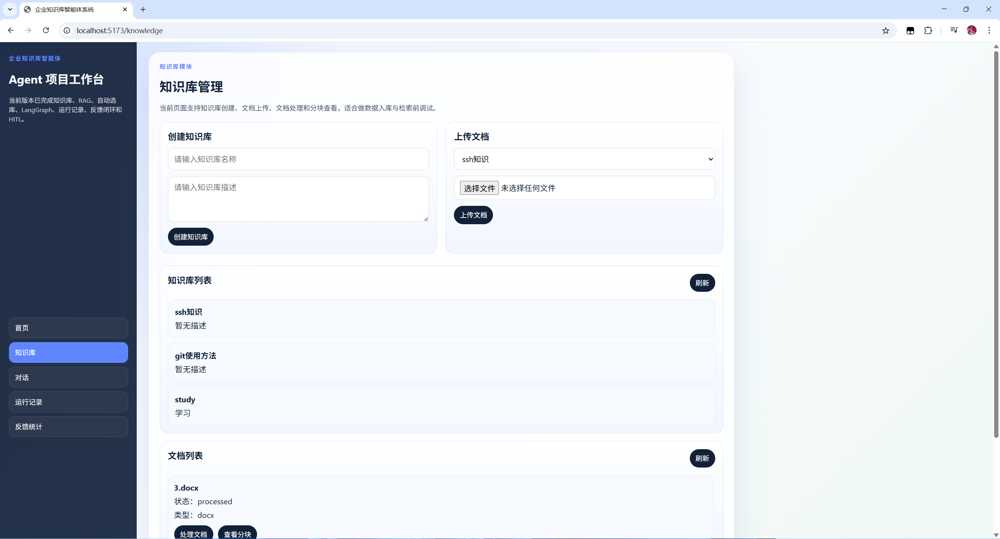
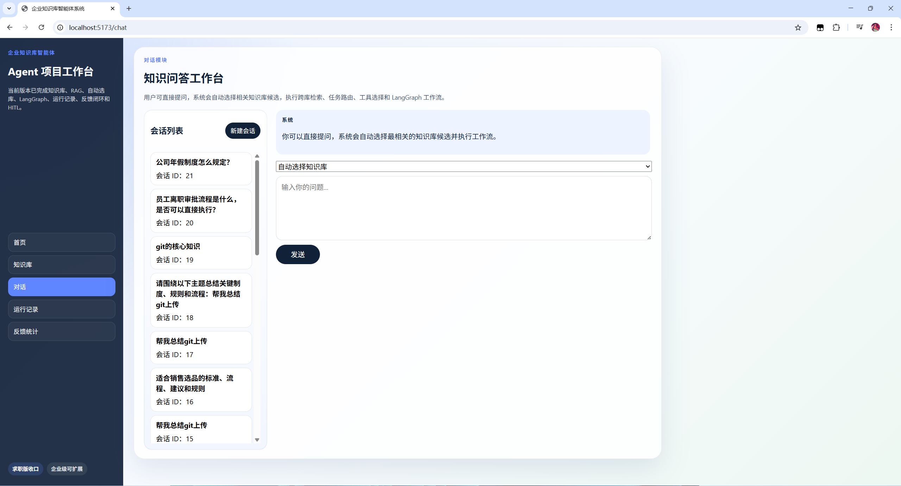
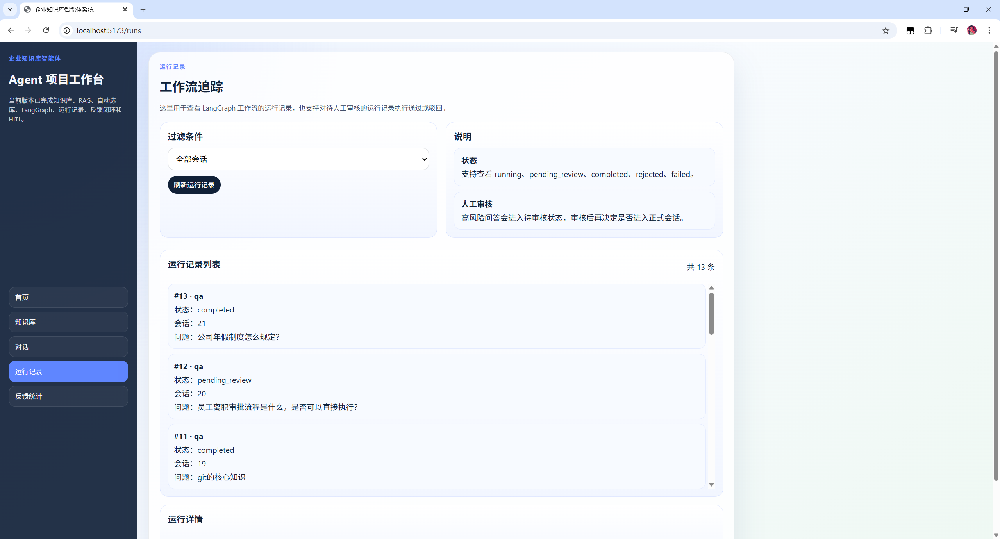
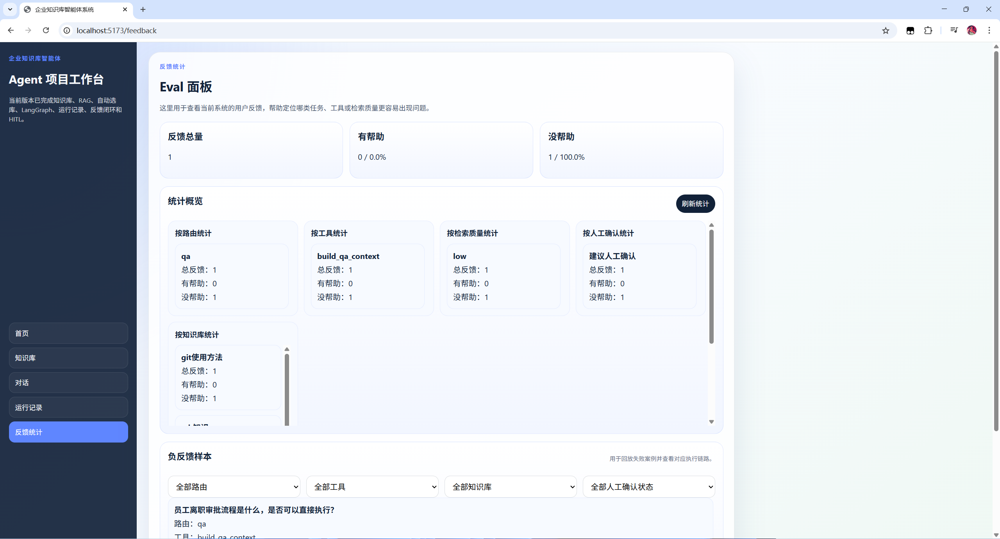

# 企业知识库智能体系统

一个面向求职展示的高完成度 AI 应用项目，也是一个为后续企业化扩展预留边界的 Agent 系统原型。

当前定位：

`高完成度 AI 应用项目 / Agent 系统原型，不宣称为生产级企业系统`

## 项目简介

这个项目围绕“企业知识库问答”展开，不是只做一个单点 RAG Demo，而是把知识库入库、检索增强、任务路由、LangGraph 工作流、运行追踪、反馈闭环和 HITL 串成了一条完整链路。

它适合用来展示以下能力：

- 端到端 RAG 应用构建能力
- Agent 工作流设计与拆解能力
- 服务化和工程化组织能力
- 可观测性、反馈闭环与 HITL 设计能力
- 面向企业场景的扩展意识与系统边界设计能力

## 核心功能

- 文档上传、解析与处理，支持 `txt / md / pdf / docx`
- 多策略分块、向量化与向量检索
- 基础 RAG 问答
- 自动选库与跨知识库检索
- 查询改写与双路检索
- 任务路由：`qa / summary / comparison`
- Agent Tools 与 LangGraph 工作流
- 流式问答输出
- 会话与消息持久化
- `agent_runs` 运行记录与工作流轨迹查看
- 用户反馈统计与负反馈样本分析
- 高风险问题人工审核建议与 `pending_review` 流程

## 技术栈

- 后端：`FastAPI`、`SQLAlchemy`、`PostgreSQL`、`pgvector`、`Redis`
- 智能体：`LangGraph`、`LangChain`、自定义 Agent Tools
- 前端：`Vue 3`、`Vite`
- 部署：`Docker`、`Docker Compose`

## 系统结构

```text
用户
  ->
Vue 前端
  ->
FastAPI API 层
  ->
服务层
  -> 知识库服务
  -> 文档服务
  -> 对话服务
  -> 检索服务
  -> 反馈服务
  -> 运行记录服务
  ->
Agent 层
  -> Agent Tools
  -> LangGraph Workflow
  ->
RAG 层
  -> 文档解析
  -> 多策略分块
  -> 向量化
  -> 检索
  -> 重排
  ->
数据层
  -> PostgreSQL
  -> pgvector
  -> Redis
```

## 推荐演示链路

如果用于面试或作品集展示，建议按这 3 条链路演示：

1. 知识库链路
   创建知识库 -> 上传文档 -> 处理文档 -> 查看分块结果
2. 问答链路
   发起问题 -> 自动选库 -> 检索增强 -> 生成回答 -> 查看引用来源
3. 可观测性链路
   查看运行记录 -> 回看工作流步骤 -> 提交反馈 -> 查看负反馈统计与样本

## 页面预览

建议补充以下截图后再上传 GitHub：

- 首页 / 项目总览
- 知识库管理页
- 对话问答页
- 运行记录页
- 反馈统计页

可按下面目录放置截图：

```text
docs/project/screenshots/
  01-knowledge-overview.png
  02-knowledge-chunks.png
  03-chat-answer.png
  04-chat-citations.png
  05-chat-review.png
  06-runs-summary.png
  07-runs-steps.png
  08-feedback-overview.png
  09-feedback-samples.png
  10-home-overview.png
  11-demo.gif
```

README 中建议优先展示这 4 张代表图：

```md




```

完整截图资源如下：

- `01-knowledge-overview.png`
- `02-knowledge-chunks.png`
- `03-chat-answer.png`
- `04-chat-citations.png`
- `05-chat-review.png`
- `06-runs-summary.png`
- `07-runs-steps.png`
- `08-feedback-overview.png`
- `09-feedback-samples.png`
- `10-home-overview.png`
- `11-demo.gif`

## 项目边界

这个项目的目标不是包装成“已经生产落地的企业级平台”，而是展示完整的 AI 应用工程能力。

当前版本更适合被理解为：

- 一个可以完整演示的 AI 应用项目
- 一个结构清晰的 Agent 工程化样例
- 一个适合在面试中展开讲解的作品集项目

当前版本暂未覆盖的生产级能力包括：

- 用户鉴权与权限控制
- 多租户与组织隔离
- 完整测试体系与持续集成
- 正式化 Eval、监控告警与审计体系
- 安全治理、灰度发布与运维保障

## 快速启动

1. 复制环境变量模板

```powershell
Copy-Item .env.example .env
```

2. 按需填写 `.env` 中的模型配置，例如 `OPENAI_API_KEY`

3. 启动项目

```powershell
docker compose down
docker compose up --build
```

4. 访问地址

- 前端：<http://localhost:5173>
- 后端：<http://localhost:8000>
- 健康检查：<http://localhost:8000/api/v1/health>

## 测试

当前仓库已经补充了两类针对关键链路的后端回归测试：

- 对话历史恢复 `agent_run` / 人工审核状态
- 反馈统计与负反馈样本聚合

测试文件位于：

- `backend/tests/test_conversation_service.py`
- `backend/tests/test_feedback_service.py`

运行前请先确保本地 Python 环境已安装后端依赖：

```powershell
cd backend
pip install -r requirements.txt
cd ..
```

然后执行：

```powershell
python -m unittest discover -s backend/tests -p "test_*.py" -v
```

如果你是通过 Docker 运行项目，也建议在容器环境中执行相同命令，避免本机 Python 环境缺少依赖。

## 目录结构

```text
enterprise-ai-agent-system/
  backend/
  frontend/
  docs/
  docker-compose.yml
  .env.example
  README.md
```

## 文档入口

文档已按 4 类收纳：

- `docs/project/`
- `docs/architecture/`
- `docs/learning/`
- `docs/phases/`

总索引见：

- [docs/README.md](./docs/README.md)

如果你想系统学习整个项目，推荐按顺序阅读：

1. [docs/learning/01-从零理解整个项目.md](./docs/learning/01-从零理解整个项目.md)
2. [docs/learning/02-项目演化历史详解.md](./docs/learning/02-项目演化历史详解.md)
3. [docs/learning/03-后端逐文件精读.md](./docs/learning/03-后端逐文件精读.md)
4. [docs/learning/04-前端逐文件精读.md](./docs/learning/04-前端逐文件精读.md)
5. [docs/learning/05-后端调用链时序讲解.md](./docs/learning/05-后端调用链时序讲解.md)
6. [docs/learning/06-前端页面交互流程讲解.md](./docs/learning/06-前端页面交互流程讲解.md)
7. [docs/learning/07-数据库设计精读.md](./docs/learning/07-数据库设计精读.md)
8. [docs/learning/08-LangGraph工作流节点精讲.md](./docs/learning/08-LangGraph工作流节点精讲.md)

## 当前阶段判断

当前项目已经足够作为高质量求职项目和 GitHub 作品集项目使用。

后续如果继续扩展，建议进入“企业化能力补齐”主线，而不是继续在当前版本里无边界堆功能。优先方向：

- 用户与权限
- 审核台与审计
- 更正式的 Eval 体系
- 安全与风险控制
- 部署、监控与运维
